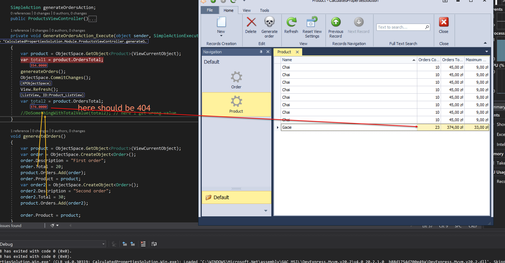

Example to issue:
https://supportcenter.devexpress.com/ticket/details/t936497/xpo-after-add-record-to-associated-collection-this-colection-stil-has-no-record

* [ProductsViewController.cs](./CS/CalculatedPropertiesSolution.Module/ProductsViewController.cs)

<!-- default file list -->
*Files to look at*:

* [Order.cs](./CS/CalculatedPropertiesSolution.Module/BusinessObjects/Order.cs) (VB: [Order.vb](./VB/CalculatedPropertiesSolution.Module/BusinessObjects/Order.vb))
* [Product.cs](./CS/CalculatedPropertiesSolution.Module/BusinessObjects/Product.cs) (VB: [Product.vb](./VB/CalculatedPropertiesSolution.Module/BusinessObjects/Product.vb))
<!-- default file list end -->
# How to calculate a master property based on values from a details collection

See the <a href="http://documentation.devexpress.com/#Xaf/CustomDocument3179">How to: Calculate a Property Value Based on Values from a Detail Collection</a> help topic for more information.

<strong>See Also:</strong> 
<a href="https://www.devexpress.com/Support/Center/p/A2944">XPO Best Practices</a> 
<a href="https://www.devexpress.com/Support/Center/p/E975">How to display details collections with descendant classes filtered by object type in a DetailView</a>

 

